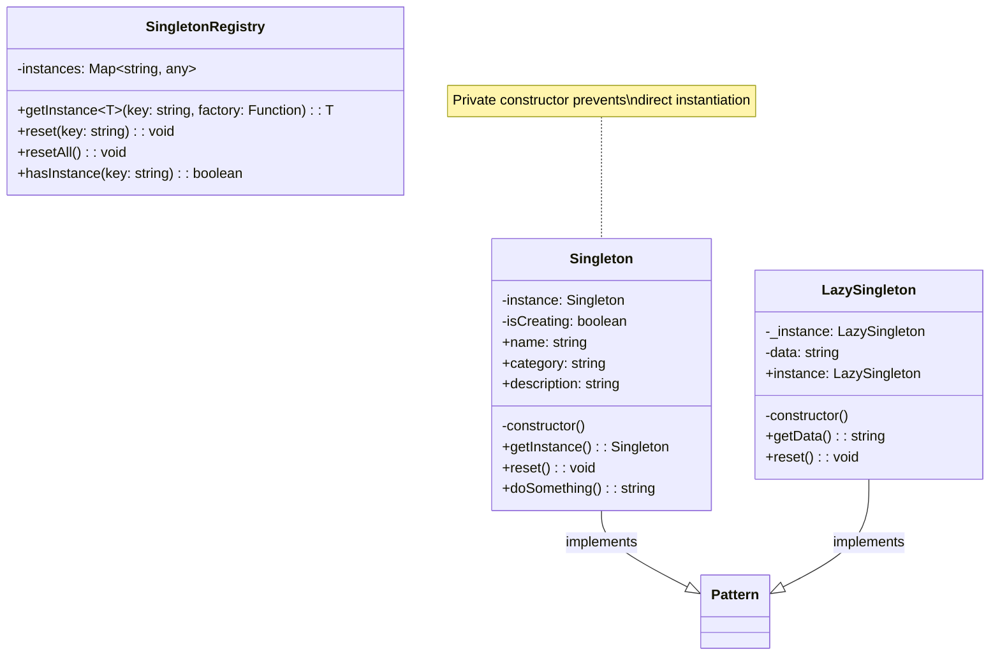
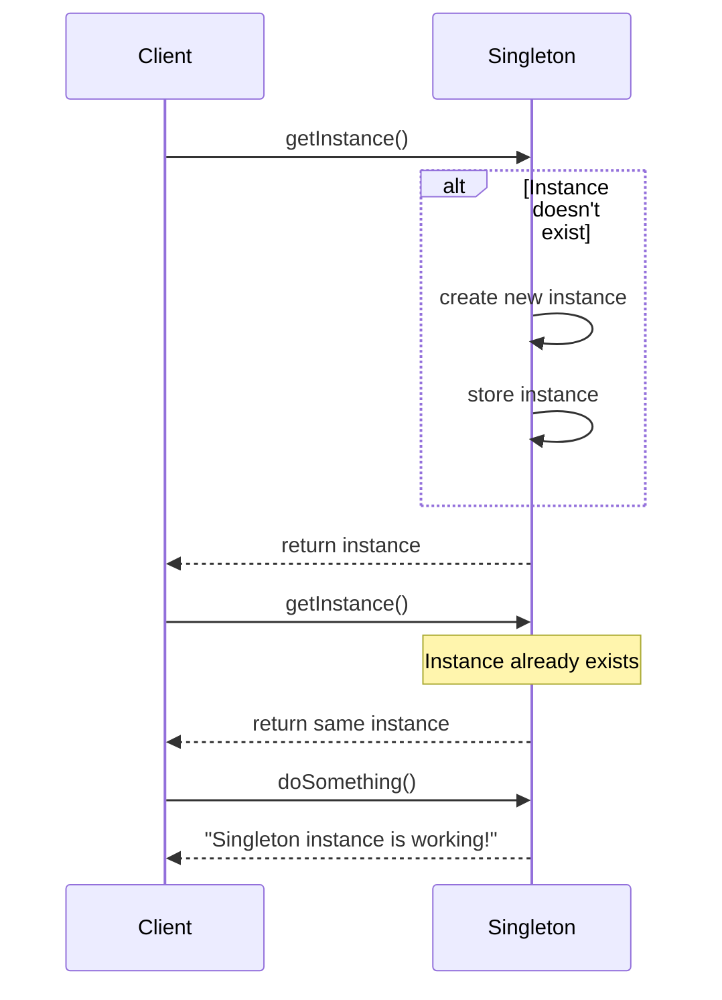

# Singleton Pattern

## Overview

The Singleton pattern ensures that a class has only one instance and provides a global point of access to that instance. This is useful when exactly one object is needed to coordinate actions across the system.

## Intent

- Ensure a class has only one instance
- Provide global access to that instance
- Control instantiation

## Structure

### UML Class Diagram



### Sequence Diagram



## Implementation

### Basic Singleton

```typescript
class Singleton {
  private static instance: Singleton;
  
  private constructor() {}
  
  public static getInstance(): Singleton {
    if (!Singleton.instance) {
      Singleton.instance = new Singleton();
    }
    return Singleton.instance;
  }
}
```

### Thread-Safe Singleton

```typescript
class ThreadSafeSingleton {
  private static instance: ThreadSafeSingleton;
  private static isCreating = false;
  
  private constructor() {
    if (!ThreadSafeSingleton.isCreating) {
      throw new Error('Use getInstance() instead');
    }
  }
  
  public static getInstance(): ThreadSafeSingleton {
    if (!ThreadSafeSingleton.instance) {
      ThreadSafeSingleton.isCreating = true;
      ThreadSafeSingleton.instance = new ThreadSafeSingleton();
      ThreadSafeSingleton.isCreating = false;
    }
    return ThreadSafeSingleton.instance;
  }
}
```

## When to Use

### Good Use Cases

- **Database connections**: Ensure only one connection pool
- **Logging services**: Centralized logging system
- **Configuration managers**: Global application settings
- **Cache managers**: Shared cache across application
- **Print spoolers**: Single printer queue
- **File system access**: Coordinated file operations

### Bad Use Cases

- **When you need multiple instances**: Obviously not suitable
- **When testing**: Makes unit testing difficult
- **When state changes frequently**: Can lead to unexpected behavior
- **In multi-threaded environments**: Without proper synchronization

## Advantages

1. **Controlled access**: Only one instance exists
2. **Global access**: Available throughout the application
3. **Lazy initialization**: Instance created only when needed
4. **Memory efficiency**: Single instance reduces memory usage
5. **Extensibility**: Can be subclassed (with care)

## Disadvantages

1. **Global state**: Can make testing difficult
2. **Hidden dependencies**: Not clear what depends on the singleton
3. **Threading issues**: Need careful synchronization
4. **Tight coupling**: Code becomes tightly coupled to singleton
5. **Single responsibility**: Often violates SRP by doing too much

## Real-World Examples

### Database Connection Manager

```typescript
class DatabaseConnection {
  private static instance: DatabaseConnection;
  private isConnected = false;
  
  private constructor() {}
  
  public static getInstance(): DatabaseConnection {
    if (!DatabaseConnection.instance) {
      DatabaseConnection.instance = new DatabaseConnection();
    }
    return DatabaseConnection.instance;
  }
  
  public connect(): void {
    if (!this.isConnected) {
      console.log('Connecting to database...');
      this.isConnected = true;
    }
  }
  
  public query(sql: string): any[] {
    if (!this.isConnected) {
      throw new Error('Database not connected');
    }
    // Execute query
    return [];
  }
}
```

### Application Logger

```typescript
class Logger {
  private static instance: Logger;
  private logs: string[] = [];
  
  private constructor() {}
  
  public static getInstance(): Logger {
    if (!Logger.instance) {
      Logger.instance = new Logger();
    }
    return Logger.instance;
  }
  
  public log(message: string, level: 'INFO' | 'WARN' | 'ERROR'): void {
    const timestamp = new Date().toISOString();
    const logEntry = `[${timestamp}] ${level}: ${message}`;
    this.logs.push(logEntry);
    console.log(logEntry);
  }
}
```

## Variations

### Lazy Singleton

```typescript
class LazySingleton {
  private static _instance: LazySingleton | null = null;
  
  private constructor() {}
  
  public static get instance(): LazySingleton {
    if (!this._instance) {
      this._instance = new LazySingleton();
    }
    return this._instance;
  }
}
```

### Enum Singleton (TypeScript)

```typescript
enum SingletonEnum {
  INSTANCE = 'INSTANCE'
}

namespace SingletonEnum {
  export function doSomething(): string {
    return 'Working!';
  }
}
```

## Testing Considerations

1. **Provide reset method**: For cleaning up between tests
2. **Use dependency injection**: Instead of direct singleton access
3. **Mock the singleton**: Create testable versions
4. **Consider using containers**: IoC containers can manage singletons

## Related Patterns

- **Abstract Factory**: Often implemented as singletons
- **Builder**: Builder instances are often singletons
- **Prototype**: Prototype registry can be a singleton
- **Facade**: Facade objects are often singletons

## Common Mistakes

1. **Not thread-safe**: In multi-threaded environments
2. **Too many responsibilities**: Singleton doing too much
3. **Hard to test**: No easy way to mock or reset
4. **Memory leaks**: Not properly cleaning up resources
5. **Inheritance issues**: Subclassing singletons is tricky

## Best Practices

1. **Make constructor private**: Prevent direct instantiation
2. **Use lazy initialization**: Create instance only when needed
3. **Thread safety**: Use proper synchronization
4. **Provide reset method**: For testing purposes
5. **Consider alternatives**: Dependency injection containers
6. **Document clearly**: Make singleton behavior obvious

## Alternatives

- **Dependency Injection**: Use IoC containers
- **Monostate Pattern**: Multiple instances with shared state
- **Factory Pattern**: Control instance creation
- **Service Locator**: Centralized service access

The Singleton pattern is powerful but should be used judiciously. Consider whether you really need global access and whether the benefits outweigh the drawbacks for your specific use case.